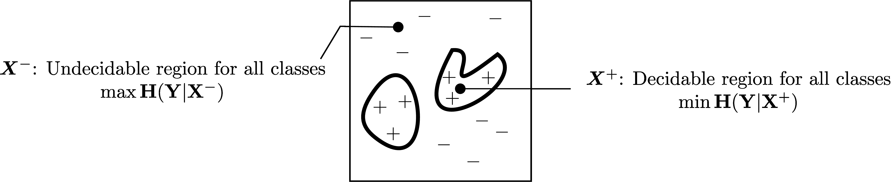
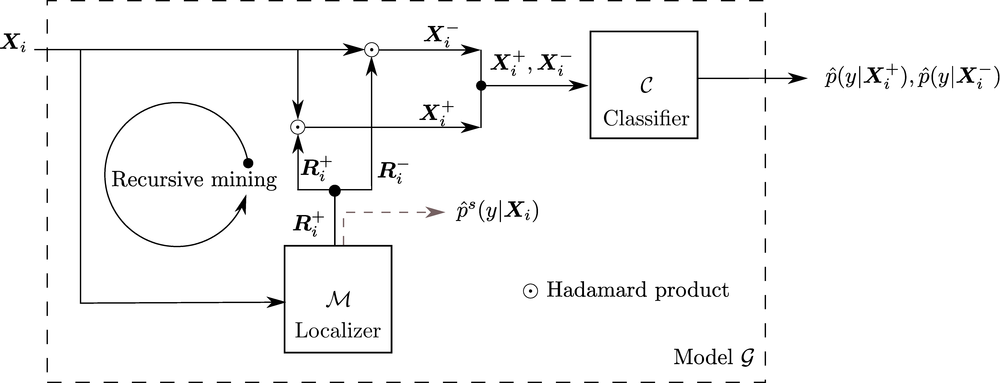
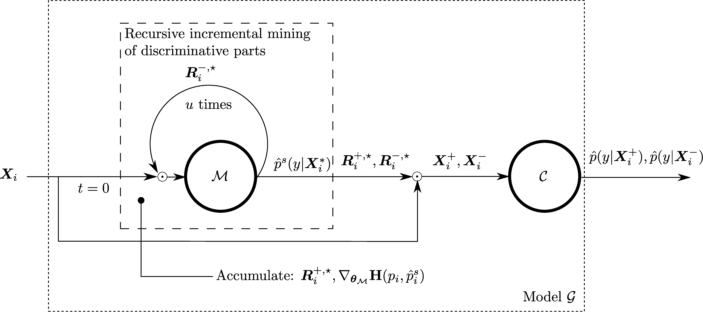

# Pytorch code for: `Min-max Entropy for Weakly Supervised Pointwise Localization`

* **arXiv**: [https://arxiv.org/abs/1907.12934](https://arxiv.org/abs/1907.12934)

* **If you use this code, please cite our work**:
```
@article{belharbi2019weakly,
  title={Min-max Entropy for Weakly Supervised Pointwise Localization
},
  author={Belharbi, S. and Rony, J. and Dolz, J. and Ben Ayed, I. and McCaffrey, L. and Granger, E.},
  journal={coRR},
  volume={abs/1907.12934},
  year={2019}
}
```

### Content:
* [Demo](#prediction-test-samples-more-results-with-high-resolution-are-in-demomd)
* [Method overview](#methodOverview)
* [Datasets](#datasets)
* [Requirements](#requirements)
* [How to run the code](#runCode)
* [Reproducibility](#reproducibility)
* [MultiGPU support and reproducibility](#multigpuSupport)
* [Synchronized-Batch-Norm support (MultiGPUs)](#synchBNSupportMultigpu)

# Prediction (test samples. More results with high resolution are in [./demo.md](./demo.md)):


# <a name="methodOverview"></a> Method overview:
## Model:



## Recursive erasing algorithm:


# <a name="datasets"></a> Datasets:
* [GlaS](https://warwick.ac.uk/fac/sci/dcs/research/tia/glascontest)
* [Caltech-UCSD Birds-200-2011](http://www.vision.caltech.edu/visipedia/CUB-200-2011.html)
* [Oxford flower 102](http://www.robots.ox.ac.uk/~vgg/data/flowers/102/)


## Download datasets:

* GlaS: [./download-glas-dataset.sh](./download-glas-dataset.sh).
* Caltech-UCSD Birds-200-2011:  [./download-caltech-ucsd-birds-200-2011-dataset.sh](./download-caltech-ucsd-birds-200-2011-dataset.sh)
* Oxford flower 102: [./download-Oxford-flowers-102-dataset.sh](./download-Oxford-flowers-102-dataset.sh)

You find the splits in [./folds](./folds). The code that generated the splits is [./create_folds.py](./create_folds.py).


# <a name="requirements"></a> Requirements:
We use [torch_nightly-1.2.0.dev20190616](https://pytorch.org/) and [Python 3.7.0](https://www.python.org). For installation, see [
./dependencies](
./dependencies) for a way on how to install the requirements within a virtual environment.

Installing some packages manually:
* Pytorch: `pip install https://download.pytorch.org/whl/nightly/cu100/torch_nightly-1.2.0.dev20190616-cp37-cp37m-linux_x86_64.whl`
* Torchvision: `pip install torchvision==0.2.2.post3`
* SPAMS:
    * `wget http://spams-devel.gforge.inria.fr/hitcounter2.php?file=file/37660/spams-python.anaconda-v2.6.1-2018-08-06.tar.gz`
    * `$ tar -xf 'hitcounter2.php?file=file%2F37660%2Fspams-python.anaconda-v2.6.1-2018-08-06.tar.gz'`
    * `$ cd spams-2.6.1/`
    * `$ python setup.py install`
* PyDenseCRF for CRF post-processing (commit: `4d5343c398d75d7ebae34f51a47769084ba3a613`): `pip install
git+https://github.com/lucasb-eyer/pydensecrf.git@4d5343c398d75d7ebae34f51a47769084ba3a613`


# <a name="runCode"></a> How to run the code:
```bash
python train_deepmil.py --cudaid your_cuda_id --yaml basename_your_yaml_file
```
You can override the values of the yaml file using command line:
```bash
python train_deepmil.py --cudaid 1 --yaml glas-no-erase.yaml --kmin 0.09 --kmax 0.09 --dout 0.0 --epoch 2 \
--nbrerase 0 --epocherase 1 --stepsize 40 --bsize 8  --modalities 5 --lr 0.001 --fold 0 --wdecay 1e-05 --alpha 0.2
```
See all the keys that you can override using the command line in  [tools.get_yaml_args()](./tools.py).

## General notes:
* All the experiments, splits generation were achieved using seed 0. See [./create_folds.py](./create_folds.py)
* All the results in the paper were obtained using one GPU.
* Please report any issue with reproducibility.

## Paths:
We hard-coded some paths (to the data location). For anonymization reasons, we replaced them with fictive paths.
So, they won't work for you. A warning will be raised with an indication to the issue. Then, the code exits. Something
like this:
```python
warnings.warn("You are accessing an anonymized part of the code. We are going to exit. Come here and fix this "
                  "according to your setup. Issue: absolute path to Caltech-UCSD-Birds-200-2011 dataset.")
```
## Configuration used in the paper:
The yaml files in [./config_yaml](./config_yaml) are used for each dataset.

## CRF post-processing
We use the implementation in (https://github.com/lucasb-eyer/pydensecrf).

To be able to use it, first install the package. Then, you can use the class: `tools.CRF()`. Read its documentation for more details. The parameters of the CRF are in [./crf_params.py](./crf_params.py). For CUB5, CUB, OxF, we used `crf_params.cub`.

# <a name="reproducibility"></a> Reproducibility
## Reproducibility (Single GPU: 100% reproducible):

We took a particular care to the reproducibility of the code.
* The code is reproducible under [Pytorch reproducibility terms](https://pytorch.org/docs/stable/notes/randomness.html).
> Completely reproducible results are not guaranteed across PyTorch releases, individual commits or different platforms.
 Furthermore, results need not be reproducible between CPU and GPU executions, even when using identical seeds.
* The code is guaranteed to be reproducible over the same device INDEPENDENTLY OF THE NUMBER OF WORKERS (>= 0). You
have to use a seed in order to obtain the same results over two identical runs. See [./reproducibility.py](./reproducibility.py)
* Samples can be preloaded in memory to avoid disc access. See [./loader.PhotoDataset()](./loader.py). DEFAULT SEED
IS 0 which we used in all our experiments.
* Samples can be preloaded AND preprocessed AND saved in memory (for inference, i.e., test). However, for large
dataset, and when the pre-processing aims at increasing the size of the data (for instance, upsampling), this is to
be avoided. See [./loader.PhotoDataset()](./loader.py)
* We decorated *sensitive* operations that use random generators by a fixed seed. This allowed more flexibility in
terms of reproducibility. For instance, if you decide to switch off pre-processing samples of a dataset (given that
such operation relies heavily on random generators) and do the processing on the fly, such a decorator seed allows the
state of the random generators in the following code to be independent of the results of this switch. This is a
work-around. In the future, we consider more clean, and easy way to make the operations that depend on random
generator independent of each other.

## Why nightly build version:
Due to some issues in the prng state of Pytorch 1.0.0, we moved to Nightly build version `1.2.0.dev20190616`
(https://download.pytorch.org/whl/nightly/cu100/torch_nightly-1.2.0.dev20190616-cp37-cp37m-linux_x86_64.whl) which
seems to have fixed a huge glitch in the rng. ([merge](https://github.com/pytorch/pytorch/pull/21301)). Please refer
to [this](https://discuss.pytorch.org/t/reproducibility-over-multigpus-is-impossible-until-randomness-of-threads-is-controled-and-yet/47079?u=sbelharbi) post.
We use this version to make multigpu case reproducible (best).

# <a name="multigpuSupport"></a> MultiGPU support and reproducibility (100% reproducibility not guaranteed. Sometimes the results are different, but most of the time the results are constant):
* The code supports MultGPUs.
* Despite our effort to make the code reproducible in the case of multigpu, we achieve reproducibility but,
sometimes it breaks. See [this](https://discuss.pytorch.org/t/reproducibility-over-multigpus-is-impossible-until-randomness-of-threads-is-controled-and-yet/47079?u=sbelharbi).


# <a name="synchBNSupportMultigpu"></a> Synchronized-Batch-Norm support (MultiGPUs):
The code supports synchronized BN. By default, SyncBN is allowed as long as multigpu mode is on. You can prevent
using SynchBN, and get back to the standard Pytroch non-synchronized BN, using bash command, before running the code:
```bash
# $ export ACTIVATE_SYNC_BN="True"   ----> Activate the SynchBN
# $ export ACTIVATE_SYNC_BN="False"   ----> Deactivate the SynchBN
```
All the credits of the SynchBN go to Tamaki Kojima(tamakoji@gmail.com) (https://github.com/tamakoji/pytorch-syncbn).
